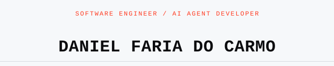
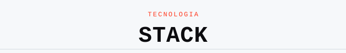
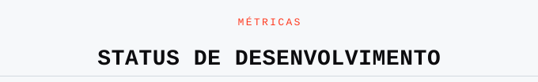
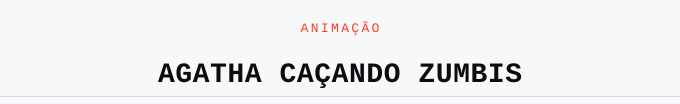

<picture>
  <source media="(prefers-color-scheme: dark)" srcset="assets/agatha-descendo-dark.svg">
  
</picture>
<picture>
  <source media="(prefers-color-scheme: dark)" srcset="assets/tina-voando-dark.svg">
  
</picture>

<picture>
  <source media="(prefers-color-scheme: dark)" srcset="assets/titulo-nome-dark.svg">
  
</picture>

*MCP Protocol · Angular & ASP.NET Core · Python · LLM Integration · RAG*

📍 Rio Verde, GO — remoto/presencial&nbsp;&nbsp;&middot;&nbsp;&nbsp;🟢 aberto a oportunidades&nbsp;&nbsp;&middot;&nbsp;&nbsp;🕸️ mascote: **Agatha** &amp; **Tina**

 

> Full stack e AI engineer construindo servidores **MCP**, agentes autônomos e arquiteturas **RAG** integradas a ERPs corporativos. Hoje no Grupo Conceito, com LLMs locais via Ollama — sem custo de API externa.

 

<picture>
  <source media="(prefers-color-scheme: dark)" srcset="assets/titulo-stack-dark.svg">
  
</picture>

**Linguagens**

**IA &amp; automação**

**Frontend**

**Backend**

**Banco de dados**

**Ferramentas**

 

<picture>
  <source media="(prefers-color-scheme: dark)" srcset="assets/titulo-status-dark.svg">
  
</picture>

<table>
<tr>
<td valign="top" width="55%">
<picture>
  <source media="(prefers-color-scheme: dark)" srcset="https://github-readme-stats-fraky.vercel.app/api?username=danifc123&show_icons=true&theme=github_dark&hide_border=true&count_private=true&hide_rank=true">
  
</picture>
</td>
<td valign="top" width="45%">
<picture>
  <source media="(prefers-color-scheme: dark)" srcset="https://github-readme-stats-fraky.vercel.app/api/top-langs/?username=danifc123&layout=compact&theme=github_dark&hide_border=true&hide=Rich%20Text%20Format&langs_count=8">
  
</picture>
</td>
</tr>
</table>

 

<picture>
  <source media="(prefers-color-scheme: dark)" srcset="assets/titulo-zumbis-dark.svg">
  
</picture>

<picture>
  <source media="(prefers-color-scheme: dark)" srcset="assets/agatha-cacando-zumbis-dark.svg">
  
</picture>

